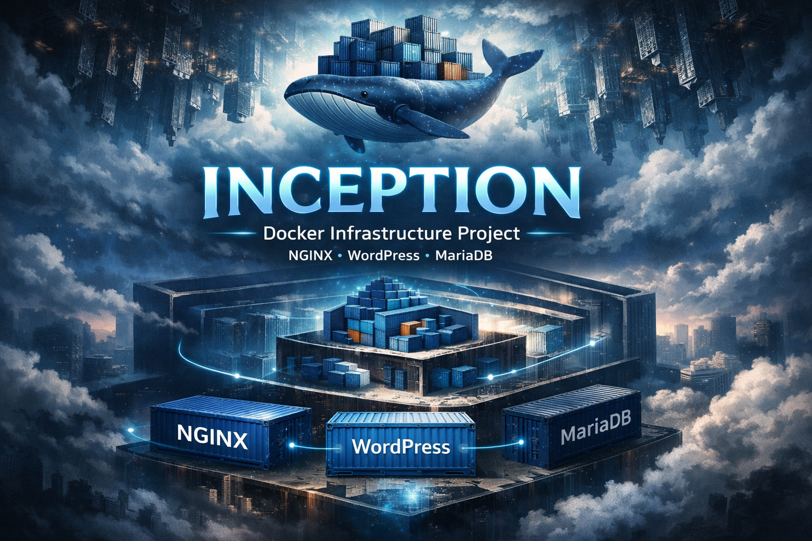

A fully containerized web infrastructure that orchestrates NGINX, WordPress, and MariaDB using Docker Compose — built entirely from scratch without pre-built images.

## Overview

Inception is a system administration project from the 42 School curriculum that replicates a production-like web server stack. Every service runs in its own custom-built Docker container, with strict isolation enforced through a private Docker network, persistent named volumes, and Docker secrets for credential management.

The goal was to understand how real infrastructure is assembled — not by pulling ready-made images, but by writing each Dockerfile from scratch, configuring each service manually, and wiring everything together securely with TLS-only HTTPS.

**Score: 100/100**  
*Completed as part of the 42 School curriculum.*

## Demo


## Tech Stack

- **Containerization:** Docker, Docker Compose
- **Web Server:** NGINX (TLSv1.2 / TLSv1.3, self-signed SSL)
- **Application Runtime:** WordPress + PHP-FPM 7.4, WP-CLI
- **Database:** MariaDB
- **Base Image:** Debian Bullseye Slim (all containers)
- **Secret Management:** Docker Secrets
- **Build System:** Make

## Architecture / Implementation

### Service Breakdown

**NGINX** (`srcs/requirements/nginx/`)
- Sole entry point to the stack — listens exclusively on port 443
- Enforces TLS 1.2/1.3 with a self-signed RSA-2048 certificate generated at build time
- Proxies PHP requests to WordPress via FastCGI on `wordpress:9000`
- Serves static WordPress files from a shared named volume

**WordPress + PHP-FPM** (`srcs/requirements/wordpress/`)
- Runs `php-fpm7.4` as the application process, bound to TCP port 9000
- WP-CLI is installed at build time and used in the entrypoint script to automate WordPress installation and user provisioning on first boot
- Database passwords and WordPress credentials are injected via Docker Secrets (never stored in environment variables)

**MariaDB** (`srcs/requirements/mariadb/`)
- Initialized with `mysql_install_db` on first run
- A templated SQL init script creates the database, user, and sets permissions
- Credentials are read from Docker Secret files at container startup (`envsubst` expands them into the SQL template)
- A dedicated healthcheck script (`healthcheck.sh`) verifies the server is accepting connections before dependent services start

### Key Technical Decisions

- **No pre-built images:** All containers are built on `debian:bullseye-slim`, giving full control over what is installed and reducing attack surface
- **Docker Secrets:** Passwords are never exposed in environment variables or image layers — they are read from in-memory files mounted by the Docker daemon
- **Private network:** All inter-service traffic stays on `private_net`; only NGINX exposes a host port
- **Persistent volumes:** Database and WordPress files are bind-mounted to `~/data/` on the host VM, surviving container restarts
- **Healthchecks:** Each service declares a healthcheck; dependent services use `depends_on` to wait for readiness

## Features

- 🔒 HTTPS-only access enforced at the NGINX layer (TLSv1.2 / TLSv1.3)
- 🐳 All services built from scratch on Debian Bullseye — no pre-built Docker Hub images
- 🔑 Credentials managed exclusively via Docker Secrets, never in plain environment variables
- ⚙️ Fully automated WordPress setup via WP-CLI (database, admin user, regular user provisioned on first boot)
- 🩺 Container healthchecks for NGINX, MariaDB, and WordPress
- 📦 Named Docker volumes with bind mounts for persistent data
- 🌐 Isolated private Docker network — only NGINX is reachable from the host
- 🛠️ Comprehensive Makefile with `build`, `start`, `stop`, `restart`, `logs`, `status`, and `fclean` targets

## Getting Started

### Prerequisites

- Docker Engine 20.10+
- Docker Compose v2.0+
- `make`

### Setup

1. **Clone the repository:**
   ```bash
   git clone https://github.com/chilituna/inception.git
   cd inception
   ```

2. **Create the secrets directory** with the required credential files:
   ```bash
   mkdir -p secrets
   echo "your_db_password"        > secrets/db_password.txt
   echo "your_db_root_password"   > secrets/db_root_password.txt
   echo "your_wp_admin_password"  > secrets/wp_admin_pw.txt
   echo "your_wp_user_password"   > secrets/wp_user_pw.txt
   ```

3. **Create and fill in the environment file** from the provided template:
   ```bash
   cp srcs/template.env srcs/.env
   # Edit srcs/.env — see the Environment Variables section below
   ```

4. **Build and start the stack:**
   ```bash
   make build
   ```

5. **Open the WordPress site** in your browser:
   ```
   https://<your-domain>/
   ```

### Environment Variables

All non-secret configuration lives in `srcs/.env`. Copy `srcs/template.env` and fill in each value:

| Variable | Description | Example |
|---|---|---|
| `DOMAIN_NAME` | Domain used by NGINX and WordPress | `aarponen.42.fr` |
| `DB_NAME` | Database name for WordPress | `wordpress_db` |
| `DB_USER` | Database user | `wordpress_user` |
| `DB_HOST` | Database host (service name in Compose) | `mariadb` |
| `SITE_TITLE` | Title of the WordPress site | `My Site` |
| `WP_ADMIN` | Admin username | `admin` |
| `WP_ADMIN_EMAIL` | Admin email address | `admin@example.com` |
| `WP_USER` | WordPress editor username | `editor` |
| `WP_USER_EMAIL` | WordPress editor email address | `editor@example.com` |

> **Note:** Passwords are **not** stored in `.env` — they are managed via Docker Secrets in the `secrets/` directory.

### Makefile Commands

| Command | Description |
|---|---|
| `make build` | Build images and start all containers |
| `make start` | Start stopped containers |
| `make stop` | Stop running containers |
| `make restart` | Restart all containers |
| `make status` | Show container status |
| `make logs` | Follow live container logs |
| `make fclean` | Stop containers and remove images and volumes |
| `make fullreset` | Full teardown and rebuild without cache |

## Project Structure

```
inception/
├── Makefile                        # Build and lifecycle management
├── srcs/
│   ├── docker-compose.yml          # Service orchestration
│   ├── template.env                # Environment variable template
│   └── requirements/
│       ├── nginx/
│       │   ├── Dockerfile          # NGINX image (TLS, no HTTP)
│       │   └── conf/
│       │       └── nginx.conf      # Server block: SSL, FastCGI proxy
│       ├── mariadb/
│       │   ├── Dockerfile          # MariaDB image
│       │   └── tools/
│       │       ├── docker-entrypoint.sh  # DB init and startup
│       │       ├── healthcheck.sh        # Liveness probe
│       │       └── init.sql              # Database/user creation template
│       └── wordpress/
│           ├── Dockerfile          # PHP-FPM + WP-CLI image
│           └── tools/
│               └── docker-entrypoint.sh  # WP install and php-fpm launch
└── secrets/                        # Docker secret files (not committed)
    ├── db_password.txt
    ├── db_root_password.txt
    ├── wp_admin_pw.txt
    └── wp_user_pw.txt
```

## Future Improvements

- [ ] Add a Redis container for WordPress object caching
- [ ] Replace the self-signed certificate with Let's Encrypt (Certbot)
- [ ] Set up a reverse proxy with rate limiting and request filtering
- [ ] Add a monitoring stack (Prometheus + Grafana)
- [ ] Implement log aggregation (e.g., Loki or ELK stack)
- [ ] Automate VM provisioning with a tool like Vagrant or Ansible
- [ ] Add automated backups for the MariaDB volume

## What I Learned

This project gave me hands-on experience with infrastructure concepts that underpin real production environments:

- **Docker internals:** Writing multi-stage-style Dockerfiles from scratch, understanding layer caching, and minimizing image size by cleaning package manager caches
- **Service orchestration:** Wiring up multi-container applications with Docker Compose, managing startup order with `depends_on` and healthchecks
- **TLS and NGINX configuration:** Configuring SSL certificates, restricting cipher suites, and setting up FastCGI proxying
- **Secret management:** Using Docker Secrets to inject credentials safely without exposing them in environment variables or image layers
- **Linux system administration:** Configuring services (MariaDB, PHP-FPM) at the configuration file level rather than relying on higher-level automation
- **Scripting:** Writing robust entrypoint shell scripts with `set -e`, environment variable substitution, and idempotent initialization logic

---

## License

This project is licensed under the MIT License. See [LICENSE](LICENSE) for details.
